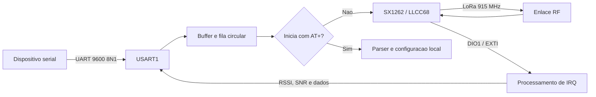

# Firmware DX-LR20/LR30 900 MHz

Firmware para comunicacao LoRa ponto a ponto usando um **STM32F103C8T6** e um
transceptor da familia **SX1262/LLCC68**. O projeto recebe dados pela USART1,
transmite o bloco recebido pelo radio e escreve na UART os pacotes LoRa
recebidos, incluindo RSSI e SNR.

O codigo original do fabricante foi migrado do Keil MDK/ARMCC para
**VS Code + PlatformIO + GCC ARM**, sem dependencia do Keil.

## Estado do projeto

- Build validado para o STM32F103C8T6.
- Framework STM32Cube HAL.
- Compilacao e link sem erros ou avisos.
- Geracao automatica de `firmware.hex` na raiz do projeto.
- Upload e depuracao configurados para ST-Link/SWD.
- Teste funcional completo no hardware deve ser feito pelo usuario.

Ultimo build de referencia:

| Recurso | Uso | Disponivel |
| --- | ---: | ---: |
| Flash | 20.096 bytes (30,7%) | 64 KiB |
| RAM | 3.588 bytes (17,5%) | 20 KiB |

## Funcionalidades

- Radio LoRa em 915 MHz com parametros configuraveis em tempo de execucao.
- Interface de comandos `AT+` pela UART, sem persistencia em Flash.
- Ponte bidirecional UART para LoRa.
- Recepcao UART por interrupcao, byte a byte.
- Empacotamento por inatividade da UART ou limite de 255 bytes.
- Fila circular de 2.000 bytes para os blocos recebidos.
- Controle externo de RX/TX do modulo de radio.
- Tratamento de `TX_DONE` e `RX_DONE` pelo DIO1/EXTI.
- Saida serial de pacotes recebidos com RSSI e SNR.
- Modo opcional de teste de onda continua (CW).
- Saida Intel HEX pronta para gravacao.

## Fluxo de funcionamento



Na inicializacao, o firmware configura o clock, UART, temporizadores, SPI,
GPIOs e radio. No laco principal, `Data_Processing()` envia pela interface LoRa
os blocos recebidos na UART, enquanto `DX_Lora_RadioIrqProcess()` processa os
eventos sinalizados pelo DIO1.

## Hardware suportado

### Microcontrolador

| Item | Configuracao |
| --- | --- |
| MCU | STM32F103C8T6 |
| Arquitetura | Arm Cortex-M3 |
| Clock do sistema | 72 MHz |
| Cristal externo | HSE de 8 MHz |
| Flash | 64 KiB |
| RAM | 20 KiB |
| Alimentacao logica | 3,3 V |

O alvo usado pelo PlatformIO e `genericSTM32F103C8`, com a definicao CMSIS
`STM32F103xB` e startup de media densidade `startup_stm32f103xb`.

### Radio

O HAL do radio foi preparado para modulos baseados em SX1262 ou LLCC68. Confirme
o modelo, o circuito de RF e os limites de potencia do seu modulo antes de
transmitir.

### Pinagem do radio

| Sinal | STM32 | Direcao no STM32 | Funcao |
| --- | --- | --- | --- |
| `NSS` | PA4 | Saida | Chip select do SPI1 |
| `SCK` | PA5 | Saida | Clock do SPI1 |
| `MISO` | PA6 | Entrada | Dados SPI do radio para o STM32 |
| `MOSI` | PA7 | Saida | Dados SPI do STM32 para o radio |
| `NRST` | PA3 | Saida | Reset do radio |
| `BUSY` | PA2 | Entrada | Estado de ocupado do radio |
| `DIO1` | PC15 | Entrada/EXTI | Interrupcoes do radio |
| `RXEN` | PA1 | Saida | Habilitacao do caminho de recepcao RF |
| `TXEN` | PA0 | Saida | Habilitacao do caminho de transmissao RF |

O DIO1 usa interrupcao por borda de subida na linha `EXTI15_10`. O clock correto
do GPIOC e habilitado pelo firmware.

### UART

| Sinal | STM32 | Configuracao |
| --- | --- | --- |
| TX | PA9 | USART1 TX |
| RX | PA10 | USART1 RX |
| Formato | - | 9600 bps, 8 bits, sem paridade, 1 stop bit |

Use um conversor USB/UART de **3,3 V**. Nao aplique sinais de 5 V diretamente
sem confirmar a tolerancia eletrica de toda a placa.

### ST-Link/SWD

| ST-Link | STM32F103C8T6 |
| --- | --- |
| SWDIO | PA13 |
| SWCLK | PA14 |
| NRST | NRST (recomendado) |
| GND | GND |
| VTref/3.3V | 3,3 V da placa |

Compartilhe o GND entre placa, ST-Link e adaptador UART.

## Configuracao LoRa padrao

Os valores padrao ficam em `LR_driver/UserConfig.h`. A configuracao ativa fica
em `g_lora_config` e e aplicada ao radio por `LoRaApplyConfig()`.

| Parametro | Valor atual |
| --- | --- |
| Frequencia | 915.000.000 Hz |
| Tipo de pacote | LoRa |
| Bandwidth | 125 kHz |
| Spreading Factor | SF9 |
| Coding Rate | 4/6 |
| Preambulo | 8 simbolos |
| Header | Explicito |
| CRC do pacote | Desabilitado |
| Inversao de IQ | Desabilitada |
| Payload maximo | 255 bytes |
| Potencia solicitada | 22 dBm |
| Ramp time | 3.400 us |
| Regulador do radio | DC-DC |
| Modo RX | Single mode, reaberto apos cada evento |

Os dois radios precisam usar a mesma frequencia, bandwidth, spreading factor,
coding rate, formato de header, CRC, IQ e preambulo.

> **Atencao:** 915 MHz e 22 dBm podem nao ser permitidos em todas as regioes ou
> em todas as condicoes de operacao. E responsabilidade do integrador cumprir a
> regulamentacao local, limites de potencia, duty cycle e homologacao aplicavel.

## Protocolo UART

### Transmissao UART para LoRa

Com `TEST` igual a `0`, todo bloco recebido na USART1 que **nao** comeca
exatamente com `AT+` e enviado como payload LoRa. Blocos iniciados por `AT+`
sao comandos locais e nunca sao transmitidos pelo radio.

Um bloco e fechado quando ocorre uma destas condicoes:

1. O buffer chega a 255 bytes.
2. A UART fica aproximadamente 5 ms sem receber outro byte.

O timeout e implementado pelo TIM3. Os blocos aguardam em uma fila circular de
2.000 bytes e sao transmitidos quando o radio esta disponivel.

Exemplo enviado para a UART:

```text
Ola LoRa!
```

O conteudo desse bloco sera usado diretamente como payload do pacote LoRa.
Os bytes de payload normal nao sao aparados nem alterados pelo parser.

### UART Command Interface

A interface usa a mesma USART1 em **9600 8N1**. Cada comando deve ser enviado
como um unico bloco UART. `CR`, `LF`, espacos e tabulacoes no final sao removidos
somente dos comandos `AT+`; isso permite usar terminais configurados com
terminadores `CR`, `LF` ou `CRLF`.

As alteracoes valem imediatamente, mas permanecem apenas na RAM. Reiniciar o
STM32 restaura os valores padrao. Antes de alterar o SX1262, o firmware valida o
valor. Para uma alteracao valida, ele salva a configuracao anterior, coloca o
radio em standby, aplica todo o perfil e retorna ao RX. Se a API do radio falhar,
o firmware restaura e reaplica o perfil anterior.

| Comando | Valores aceitos | Exemplo de resposta |
| --- | --- | --- |
| `AT+STATUS` | - | `STATUS|FREQ=915000000|BW=125000|SF=9|CR=6|POWER=22|PREAMBLE=8|CRC=0` |
| `AT+FREQ=<Hz>` | 850000000 a 930000000 | `OK|FREQ=915000000` |
| `AT+BW=<Hz>` | 125000, 250000 ou 500000 | `OK|BW=250000` |
| `AT+SF=<valor>` | 5 a 12 | `OK|SF=7` |
| `AT+CR=<denominador>` | 5, 6, 7 ou 8 | `OK|CR=5` |
| `AT+POWER=<dBm>` | -9 a 22 | `OK|POWER=10` |
| `AT+PREAMBLE=<simbolos>` | 4 a 65535 | `OK|PREAMBLE=8` |
| `AT+CRC=<estado>` | 0 (OFF) ou 1 (ON) | `OK|CRC=1` |
| `AT+DEFAULTS` | - | `OK|DEFAULTS=1` |

No comando `AT+CR`, os valores 5, 6, 7 e 8 representam respectivamente 4/5,
4/6, 4/7 e 4/8. O LDRO nao e configurado pela UART: ele e calculado
automaticamente pela duracao do simbolo e ativado quando `Tsym >= 16,384 ms`.

Exemplos de erro:

```text
ERR|CMD=SF|CODE=INVALID_VALUE
ERR|CMD=UNKNOWN
ERR|CMD=SF|CODE=RADIO_ERROR
```

`RADIO_ERROR` indica que o novo perfil nao foi aceito pelo radio e que o
firmware voltou ao anterior. `ROLLBACK_FAILED` indica uma falha adicional ao
reaplicar o perfil anterior e exige verificacao do hardware/SPI.

Exemplo de sessao:

```text
AT+STATUS
STATUS|FREQ=915000000|BW=125000|SF=9|CR=6|POWER=22|PREAMBLE=8|CRC=0
AT+SF=7
OK|SF=7
AT+SF=20
ERR|CMD=SF|CODE=INVALID_VALUE
Mensagem 123
```

O ultimo bloco continua sendo transmitido de forma transparente. No outro
radio, quando os parametros RF forem compativeis, a saida permanece:

```text
RX|RSSI=-67|SNR=8|DATA=Mensagem 123
```

Para comprovar a alteracao fisica, configure dois radios em SF9/BW125 e teste o
enlace. Altere apenas o radio A com `AT+SF=7`: a comunicacao deve parar. Aplique
`AT+SF=7` ao radio B: a comunicacao deve voltar.

### Recepcao LoRa para UART

Um pacote recebido e impresso no formato:

```text
RX|RSSI=-72|SNR=9|DATA=Ola LoRa!
```

Os bytes do payload sao escritos como caracteres. Dados binarios podem conter
caracteres nao imprimiveis; para transportar binario de forma legivel, adicione
uma codificacao como hexadecimal ou Base64.

### Mensagem de inicializacao

Ao iniciar, o firmware escreve uma mensagem semelhante a:

```text
**********************************************
-->Power On
-->V1.2.35
-->DX SX1262(LLCC68) TEST :0 915000000
**********************************************
```

## Modo de teste CW

Em `LR_driver/UserConfig.h`:

```c
#define TEST 0
```

- `TEST = 0`: operacao normal UART/LoRa.
- `TEST = 1`: ativa transmissao de onda continua com
  `sx126x_set_tx_cw()`. Nesse modo, dados enviados pela UART sao interpretados
  como frequencia em MHz pela funcao `Hz_set()`.

O modo CW transmite continuamente e deve ser usado somente em bancada, com
carga, atenuacao e instrumentacao adequadas, respeitando a regulamentacao RF.

## Estrutura do repositorio

```text
.
|-- Core/                   # Clock, interrupcoes, HAL config e syscalls GCC
|-- Driver/                 # Drivers UART, SPI, TIM2/TIM3 e DIO1
|-- LR_driver/              # Integracao da aplicacao com o SX1262/LLCC68
|   |-- src/                # Driver base Semtech SX126x
|   `-- LICENSE.txt         # Licenca do driver Semtech
|-- Main/                   # main(), callbacks UART/TIM e laco principal
|-- quequ/                  # Fila circular usada pela recepcao UART
|-- scripts/                # Exportacao automatica do Intel HEX
|-- platformio.ini          # Configuracao principal do PlatformIO
|-- README.md               # Esta documentacao
`-- firmware.hex            # Artefato gerado localmente (ignorado pelo Git)
```

## Pre-requisitos

### Opcao recomendada: VS Code

1. Instale o [Visual Studio Code](https://code.visualstudio.com/).
2. Instale a extensao **PlatformIO IDE**.
3. Instale o driver do ST-Link usado na sua maquina.

Na primeira compilacao, o PlatformIO precisa de acesso a internet para baixar a
plataforma STM32, o STM32CubeF1 e o GCC ARM.

### Opcao por linha de comando

Instale o PlatformIO Core conforme a documentacao oficial ou use o Core que
acompanha a extensao do VS Code.

Verifique a instalacao:

```bash
pio --version
```

## Compilacao

### Pelo VS Code

1. Clone o repositorio.
2. Abra a pasta que contem `platformio.ini` no VS Code.
3. Aguarde a inicializacao do PlatformIO.
4. Execute **PlatformIO: Build** ou use o icone de check na barra inferior.

### Pelo terminal

Linux, macOS ou Windows com `pio` no `PATH`:

```bash
pio run
```

No PowerShell, usando o Core instalado pela extensao:

```powershell
& "$env:USERPROFILE\.platformio\penv\Scripts\pio.exe" run
```

O build gera os artefatos intermediarios em `.pio/build/fw/` e exporta o arquivo
final diretamente para:

```text
firmware.hex
```

As versoes principais estao fixadas ou controladas por `platformio.ini`:

| Componente | Versao validada |
| --- | --- |
| PlatformIO Core | 6.1.19 |
| Plataforma `ststm32` | 19.7.1 |
| STM32CubeF1 | 1.8.6 |
| GCC ARM Embedded | 7.2.1 |

O ambiente recebeu o nome curto `fw` para evitar o limite historico de tamanho
de caminhos do Windows quando o repositorio esta dentro de pastas longas.

### Limpar e recompilar

```bash
pio run --target clean
pio run
```

### Compilacao detalhada

```bash
pio run --verbose
```

## Gravacao

Conecte o ST-Link pela interface SWD e execute:

```bash
pio run --target upload
```

No PowerShell com o Core da extensao:

```powershell
& "$env:USERPROFILE\.platformio\penv\Scripts\pio.exe" run --target upload
```

Tambem e possivel gravar `firmware.hex` usando STM32CubeProgrammer, OpenOCD ou
outra ferramenta compativel com o STM32F103C8T6.

Antes de gravar, confirme:

- MCU STM32F103C8T6 selecionado.
- Alimentacao de 3,3 V e GND comum.
- SWDIO e SWCLK conectados corretamente.
- Pino BOOT0 em nivel baixo para iniciar pela Flash apos a gravacao.
- Antena ou carga RF adequada conectada ao modulo.

## Monitor serial

O `platformio.ini` configura automaticamente 9600 bps:

```bash
pio device monitor
```

Para sair do monitor serial do PlatformIO, use `Ctrl+C`.

Nao mantenha outro programa usando a mesma porta serial durante o upload ou o
monitoramento.

## Depuracao

O projeto usa `debug_tool = stlink`. No VS Code:

1. Conecte o ST-Link pela interface SWD.
2. Abra a aba **Run and Debug**.
3. Selecione o ambiente PlatformIO `fw`.
4. Inicie a depuracao.

Para uma sessao de debug mais legivel, altere temporariamente em
`platformio.ini`:

```ini
build_type = debug
```

Retorne para `release` antes de gerar o firmware de distribuicao.

## Personalizacao

### Alterar os valores LoRa padrao

Edite as macros `LORA_DEFAULT_*` em `LR_driver/UserConfig.h` e recompile. Para
alteracoes temporarias, use a [UART Command Interface](#uart-command-interface),
sem recompilar ou regravar o STM32. Os dois lados do enlace precisam manter
frequencia, bandwidth, SF, CR, preambulo e CRC compativeis.

### Alterar o baud rate

Edite a chamada em `Main/main.c`:

```c
UsartInit(9600);
```

Atualize tambem `monitor_speed` em `platformio.ini`.

## Solucao de problemas

### `pio` nao e reconhecido

Use o terminal do PlatformIO no VS Code ou invoque o executavel diretamente no
PowerShell:

```powershell
& "$env:USERPROFILE\.platformio\penv\Scripts\pio.exe" run
```

### Falha ao baixar pacotes

Verifique internet, proxy, firewall e permissoes de escrita na pasta
`.platformio` do usuario. Depois execute novamente `pio run`.

### Erro `No such file or directory` durante a compilacao no Windows

O caminho completo pode ter ultrapassado o limite aceito pelo toolchain. Mova o
repositorio para um caminho mais curto, por exemplo `C:\dev\dx-lora`. O nome do
ambiente `fw` ja foi mantido curto para reduzir esse risco.

### ST-Link nao detecta o MCU

- Confira GND, SWDIO, SWCLK, NRST e tensao de referencia.
- Reduza a frequencia SWD na ferramenta de gravacao.
- Tente conectar mantendo NRST em nivel baixo.
- Confirme que o driver do ST-Link esta instalado.
- Verifique BOOT0 e a alimentacao da placa.

### Firmware grava, mas nao inicia

- Confirme cristal HSE de 8 MHz.
- Confirme BOOT0 em nivel baixo.
- Observe a mensagem de inicializacao em PA9 a 9600 bps.
- Confira se o firmware foi gerado para STM32F103C8T6, nao para F103ZE.

### Radio nao responde

- Verifique NSS, SCK, MISO, MOSI, NRST e BUSY.
- Confirme alimentacao e GND do modulo.
- Confira se `BUSY` retorna ao nivel baixo.
- Confirme o modelo SX1262/LLCC68 e o controle externo RXEN/TXEN.

### Transmite, mas nao recebe

- Verifique DIO1 em PC15 e a borda de subida da interrupcao.
- Confirme que os dois radios usam os mesmos parametros LoRa.
- Confira antena, frequencia e caminho RXEN/TXEN.
- Observe RSSI e SNR recebidos na UART.

### Dados UART sao divididos em varios pacotes

O firmware fecha o bloco apos aproximadamente 5 ms sem novos bytes. Envie o
conteudo sem pausas maiores ou ajuste a configuracao do TIM3 em
`Driver/driver_timer.c`.

## Validacao do HEX

No PowerShell, calcule o SHA-256 do firmware gerado:

```powershell
Get-FileHash .\firmware.hex -Algorithm SHA256
```

O hash muda sempre que o conteudo do firmware muda. Publique o hash junto aos
binarios de uma GitHub Release para permitir verificacao da integridade.

## Publicacao no GitHub

Arquivos gerados e locais ja estao cobertos pelo `.gitignore`, incluindo
`.pio/`, `firmware.hex` e configuracoes geradas do VS Code.

Fluxo inicial sugerido:

```bash
git init
git add .
git commit -m "Migra firmware para PlatformIO"
git branch -M main
git remote add origin https://github.com/SEU_USUARIO/SEU_REPOSITORIO.git
git push -u origin main
```

Distribua `firmware.hex` preferencialmente como artefato de uma **GitHub
Release**, acompanhado da versao, hardware alvo, configuracao RF e hash SHA-256.

## Licenca

O driver SX126x derivado da Semtech possui sua propria licenca em
`LR_driver/LICENSE.txt`.

O restante do projeto nao possui atualmente uma licenca global declarada. Antes
de permitir redistribuicao ou contribuicoes de terceiros, confirme que voce tem
direito de relicenciar o codigo original do fabricante e adicione uma licenca na
raiz do repositorio. A publicacao no GitHub, por si so, nao concede permissao de
uso, modificacao ou redistribuicao.

## Avisos

- Este firmware controla equipamento de radiofrequencia.
- Nao transmita sem antena ou carga apropriada.
- Nao exceda os limites eletricos do STM32 ou do modulo RF.
- Confirme a regulamentacao aplicavel a frequencia e potencia usadas.
- Teste o firmware em bancada antes de qualquer uso operacional.
